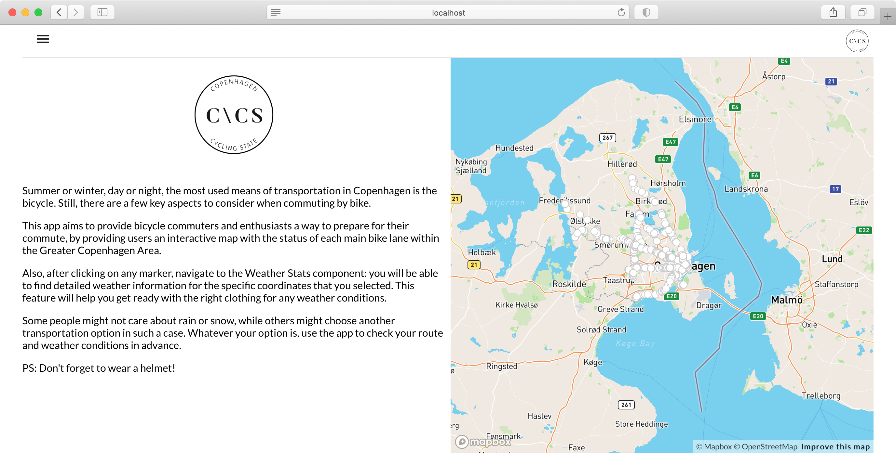

## Copenhagen Cycling State



### About

The project is a React application for tracking cycling conditions in Copenhagen, Denmark.

The app connects to APIs provided by the [Norwegian Meteorological Institute](https://api.met.no/weatherapi/), the [City of Copenhagen](https://www.opendata.dk/city-of-copenhagen/supercykelsti-inspektioner) and [Google Maps Geocoding API](https://developers.google.com/maps/documentation/geocoding/overview), in order to retrieve data regarding weather conditions, addresses and bicycle paths state.

Further usage instructions can be found in the application GUI.

#### Used technologies & frameworks

- Libraries:
  - React.JS
  - react-router-dom
  - mapbox-gl
  - react-geocode
  - recharts
  - @material-ui
- APIs:
  - [Norwegian Meteorological Institute API](https://api.met.no/weatherapi/)
  - [Open Data API](https://www.opendata.dk/city-of-copenhagen/supercykelsti-inspektioner) - City of Copenhagen
  - [Google Maps Geocoding API](https://developers.google.com/maps/documentation/geocoding/overview)

### Installation guidelines

#### Adding the Google Maps Geocoding API

Navigate to [https://console.cloud.google.com](https://console.cloud.google.com) and create a new Geocoding API.

In directory `src` add a new JSON file named `GeolocationApi.json` that has the following contents:

```
{
  "apiKey": "YourGoogleApiKey"
}
```

The system will retrieve the API key by itself in the views that require it.

#### Installing dependencies

Run the following command in the root project directory for installing all the necessary dependencies:

### `npm install --save`

#### Running the application

For running the React app, run:

### `npm start`

Runs the app in the development mode.<br />
Open [http://localhost:3000](http://localhost:3000) to view it in the browser.

The page will reload if you make edits.<br />
You will also see any lint errors in the console.
