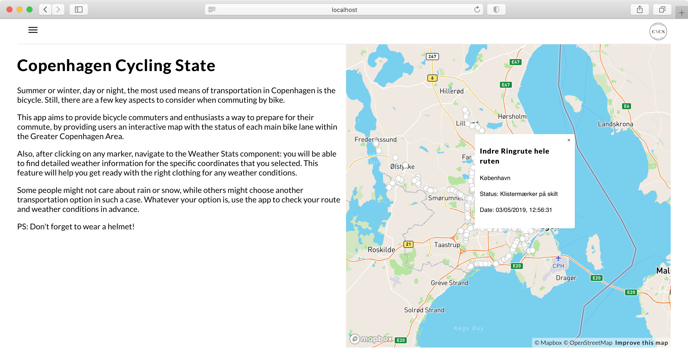

## Copenhagen Cycling State

## About

The project is a React application for tracking cycling conditions in Copenhagen, Denmark.

The app connects to APIs provided by the [Norwegian Meteorological Institute](https://api.met.no/weatherapi/) and the [City of Copenhagen](https://www.opendata.dk/city-of-copenhagen/supercykelsti-inspektioner), in order to retrieve data regarding weather conditions and bicycle paths state.

Further usage instructions can be found in the application GUI.

### Used technologies & frameworks

- React.JS
- react-router-dom
- mapbox-gl
- recharts
- @material-ui

## Installation guidelines

Run the following command in the root project directory for installing all the necessary dependencies:

### `npm install --save`

For running the React application, run:

### `npm start`

Runs the app in the development mode. 
Open [http://localhost:3000](http://localhost:3000) to view it in the browser.

The page will reload if you make edits. 
You will also see any lint errors in the console.
